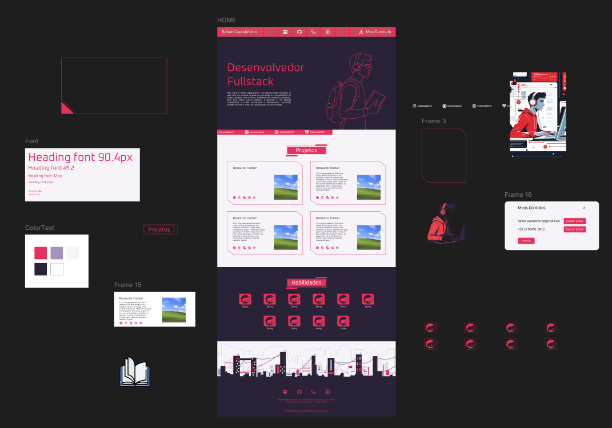

# 📖 Seja bem vindo(a) ao meu portfólio!
Este site foi construído com o objetivo de mostrar minhas habilidades e experiências de forma profissional.

## Por onde acessar?
Você pode acessar o portfólio diretamente no link [https://fael890.github.io/my-portfolio/](Meu Portfólio)

Caso queira baixar e explorar o projeto, você precisa ter os seguintes pré requisitos:
- Node versão 22.x (recomendado: 22.12.0 ou superior dentro da mesma versão principal)
- Gerenciador de pacotes: NPM (vem junto com o Node) ou o Yarn

## 💻 Passos para rodar o projeto
1. Clonar o repositório
  `git clone https://github.com/fael890/my-portfolio.git`
2. Instalar dependências:
   `npm install`
3. Executar o projeto:
   `npm run dev`
4. Acesse o link `http://localhost:5173` no navegador.

## :pencil2: Desenvolvimento
### :book: Tecnologias utilizadas
     

### Prototipagem no Figma

O Figma é uma ferramenta extremamente poderosa para design de interfaces, e a imagem acima exemplifica isso. Fiz vários esboços até chegar em algo que realmente me agradasse. Além disso, construi vários componentes, o que facilitou muito a etapa de codificação. Muitas ideias presentes no protótipo foram descartadas — e isso é totalmente esperado, já que um protótipo não representa a versão final do site, mas sim um facilitador no processo de desenvolvimento.

### :file_folder: Estrutura do Projeto
- **public/**: contém todos os arquivos públicos do site.
- **src/**: diretório principal do projeto, com todos os componentes e arquivos.
- **src/components/**: abriga os componentes, organizados em subdiretórios.
- **src/data/**: contém os dados mockados utilizados pelos componentes.
- **src/types/**: guarda os tipos e interfaces utilizadas no TypeScript.

## :rocket: Finalização
**Obrigado por visitar este repositório!**
Se, ao visualizar o portfólio, você encontrar algo incorreto — como um erro de layout, por exemplo —, sinta-se à vontade para entrar em contato comigo pelo e-mail rafael.capodeferro@gmail.com.
Ah, e se puder compartilhar meu portfólio com outras pessoas, eu agradeço muito! 😉